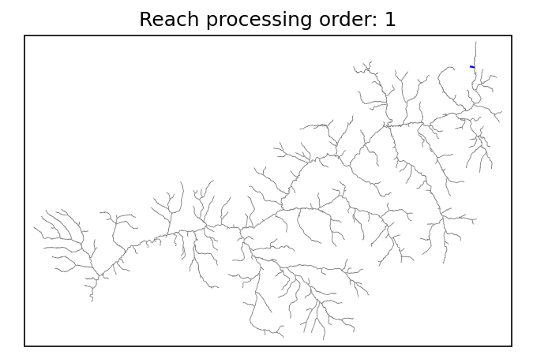
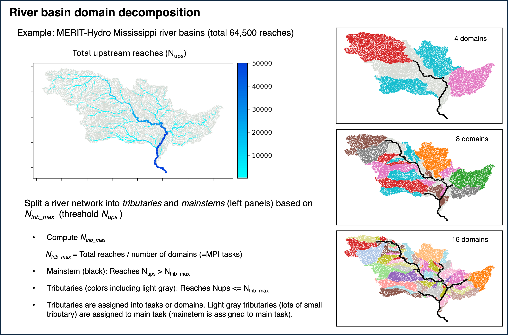
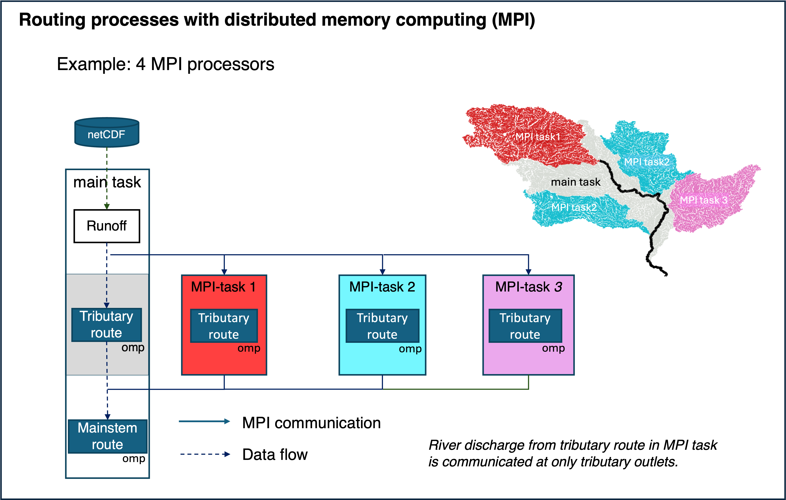

.. _navigate_river_network:

Navigate river network
=======================

MizuRoute performs reach routing scheme(s) described in :ref:`River_routing_schemes`, from headwater reaches to outlets in river basin(s) in the order so that at each computing time step (``dt_qsim``), outflow from one reach can be passed to its immediate downstream reach, becoming upstream boundary condition of its immediate downstream reach.
Key parameters of river network topology are reach ID (``segId``: default name in river input netCDF) and immediate downstream reach ID (``downSegId``). Similarly, HRU has HRU id (``HRUid``) and ID of reach that runoff from this HRU flows into (``hruSegId``).
The routing order is internally computed in mizuRoute based on the reach topology variables: ``segId`` and ``downSegId``.

A example of routing order in a river basin is shown below. A basic rule of routing order is that given any reach, the orders of all the upstream reaches of that reach are earlier order.

.. _Figure routing_processing_order:

 An Examplel of routing orders for a basin.

.. _domain_decomposition:

Domain decomposition
--------------------------

MizuRoute supports MPI parallel computing, where the river network is split into many independent tributary domains and mainstem domain which all the tributary domain flows into. Given a number of MPI task (i.e., computing cores), mizuRoute assigns each tributary domain into task, including main task, such that the total number of reaches assigned to each task are approximately similar.
Figure :numref:`Figure river_network_decomposition` illustrates the domain descompoistion process for Mississippii River basin example. The same procedure can be applied to the river network including mulitplie independent river basins, such as global domain river modeling.
Currently, mizuRoute uses total upstream reach number, computed for each reach, as a guidance to delineate tributary domains. Any reaches below tributary domains is defined as mainstem domain.

As shown in :numref:`Figure MPI_routing_computation`, for parallel computing, all the tasks compute tributary reaches simultaneously, but mainsteam domain has to wait till all the tributary reaches are all routed. After tributary reach routing, discharge at outlet of each tributary domain is communicated to main task and passed to ghost reach that immediate upstream of very top of mainstem reaches, so that mainstem routing can properly route upstream flow from the tributary domain.

Additionally, each tributary domain can be further split into multiple tributaries, which can be parallelized using shared memory OpenMP (OMP) within each MPI task.

This parallelization scheme is described in :ref:`Mizukami et al. (2021) <Mizukami2021>`.

.. _Figure river_network_decomposition:

 Procedure of domain decomposition of River basin(s).

.. _Figure MPI_routing_computation:

 Data flow in routing computation at MPI tasks

this section is working in progress.....
